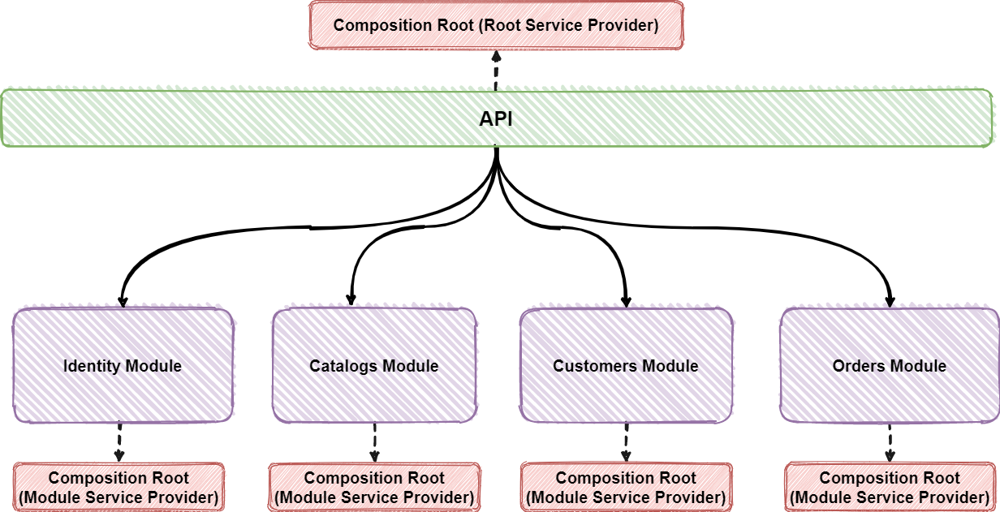
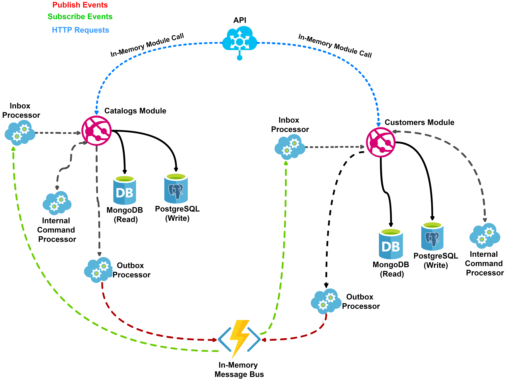
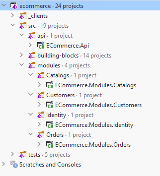
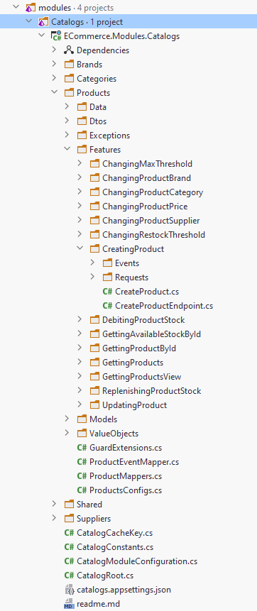

# 🪣 ECommerce Modular Monolith

[](https://github.com/mehdihadeli/ecommerce-modular-monolith-sample/actions/workflows/build-test.yml)
[](https://gitpod.io/#https://github.com/mehdihadeli/ecommerce-modular-monolith-sample)


> `ECommerce Modular Monolith` is a fictional ecommerce sample, built with .Net Core and different software architecture and technologies like **Modular Monolith Architecture**, **Vertical Slice Architecture** , **CQRS Pattern**, **Domain Driven Design (DDD)**, **Event Driven Architecture**. For `communication` between independent modules, we use asynchronous messaging with using our [In-Memory Broker](src/BuildingBlocks/BuildingBlocks.Core/Messaging/Broker/InMemory/InMemoryBus.cs), and sometimes we use synchronous communication for real-time communications with using REST and gRPC calls.

This application ported to `microservices architecture` in another repository which is available in [ecommerce-microservices-sample](https://github.com/mehdihadeli/ecommerce-microservices-sample) repository.

🌀 Keep in mind this repository is work in progress and will be complete over time 🚀

# ⭐ Support
If you like feel free to ⭐ this repository, It helps out :)

Thanks a bunch for supporting me!

# Table of Contents

- [Plan](#plan)
- [Technologies - Libraries](#technologies---libraries)
- [The Domain and Bounded Context - Modules Boundary](#the-domain-and-bounded-context---modules-boundary)
- [Application Architecture](#application-architecture)
- [Application Structure](#application-structure)
- [Vertical Slice Flow in Modules](#vertical-slice-flow-in-modules)
- [Prerequisites](#prerequisites)
- [How to Run](#how-to-run)
- [Contribution](#contribution)
- [Project References](#project-references)
- [License](#license)


## Plan

> This project is in progress, New features will be added over time.

High-level plan is represented in the table

| Feature | Status |
| ------- | ------ |
| Building Blocks | Completed ✔️ |
| API | Completed ✔️ |
| Identity Module | Completed ✔️ |
| Customer Module | Completed ✔️ |
| Catalog Module | Completed ✔️ |
| Order Module |  In Progress 👷‍|
| Shipping Module | Not Started 🚩 |
| Payment Module | Not Started 🚩 |

## Technologies - Libraries

- ✔️ **[`.NET 7`](https://dotnet.microsoft.com/download)** - .NET Framework and .NET Core, including ASP.NET and ASP.NET Core
- ✔️ **[`Npgsql Entity Framework Core Provider`](https://www.npgsql.org/efcore/)** - Npgsql has an Entity Framework (EF) Core provider. It behaves like other EF Core providers (e.g. SQL Server), so the general EF Core docs apply here as well
- ✔️ **[`FluentValidation`](https://github.com/FluentValidation/FluentValidation)** - Popular .NET validation library for building strongly-typed validation rules
- ✔️ **[`Swagger & Swagger UI`](https://github.com/domaindrivendev/Swashbuckle.AspNetCore)** - Swagger tools for documenting API's built on ASP.NET Core
- ✔️ **[`Serilog`](https://github.com/serilog/serilog)** - Simple .NET logging with fully-structured events
- ✔️ **[`Polly`](https://github.com/App-vNext/Polly)** - Polly is a .NET resilience and transient-fault-handling library that allows developers to express policies such as Retry, Circuit Breaker, Timeout, Bulkhead Isolation, and Fallback in a fluent and thread-safe manner
- ✔️ **[`Scrutor`](https://github.com/khellang/Scrutor)** - Assembly scanning and decoration extensions for Microsoft.Extensions.DependencyInjection
- ✔️ **[`Opentelemetry-dotnet`](https://github.com/open-telemetry/opentelemetry-dotnet)** - The OpenTelemetry .NET Client
- ✔️ **[`DuendeSoftware IdentityServer`](https://github.com/DuendeSoftware/IdentityServer)** - The most flexible and standards-compliant OpenID Connect and OAuth 2.x framework for ASP.NET Core
- ✔️ **[`Newtonsoft.Json`](https://github.com/JamesNK/Newtonsoft.Json)** - Json.NET is a popular high-performance JSON framework for .NET
- ✔️ **[`AspNetCore.Diagnostics.HealthChecks`](https://github.com/Xabaril/AspNetCore.Diagnostics.HealthChecks)** - Enterprise HealthChecks for ASP.NET Core Diagnostics Package
- ✔️ **[`Microsoft.AspNetCore.Authentication.JwtBearer`](https://www.nuget.org/packages/Microsoft.AspNetCore.Authentication.JwtBearer)** - Handling Jwt Authentication and authorization in .Net Core
- ✔️ **[`NSubstitute`](https://github.com/nsubstitute/NSubstitute)** - A friendly substitute for .NET mocking libraries.
- ✔️ **[`StyleCopAnalyzers`](https://github.com/DotNetAnalyzers/StyleCopAnalyzers)** - An implementation of StyleCop rules using the .NET Compiler Platform
- ✔️ **[`AutoMapper`](https://github.com/AutoMapper/AutoMapper)** - Convention-based object-object mapper in .NET.
- ✔️ **[`Hellang.Middleware.ProblemDetails`](https://github.com/khellang/Middleware/tree/master/src/ProblemDetails)** - A middleware for handling exception in .Net Core
- ✔️ **[`IdGen`](https://github.com/RobThree/IdGen)** - Twitter Snowflake-alike ID generator for .Net


## The Domain And Bounded Context - Modules Boundary

`ECommerce Modular Monolith` is a simple ecommerce api sample that has the basic business scenario for online purchasing with some dedicated modules. There are six possible `Bounded context` or `Module` for above business:

- `Identity Module`: the Identity Module, uses to authenticate and authorize users through a token. Also, this module is responsible for creating users and their corresponding roles and permission with using [.Net Core Identity](https://docs.microsoft.com/en-us/aspnet/core/security/authentication/identity) and Jwt authentication and authorization. I will add also [Identity Server](https://github.com/DuendeSoftware/IdentityServer) in future for this module. Each of `Administrator`, `Customer` and `Supplier` are a `User`, actually a `IdentityUser`. To be a User, User Registration is required. Each User is assigned one or more User Role. Each User Role has set of Permissions. A Permission defines whether User can invoke a particular action or not.

- `Catalog Module`: The Catalog Module presents the ability to add items to our ecommerce, It can be electronics, foods, books or anything else. Items can be grouped into categories and catalogs. A catalog is defined as a list of items that a company showcases online. the catalog is a collection of items, which can be grouped into categories. An item can be assigned to only one category or be direct child of a catalog without any category.
Buyer can browse the products list with supported filtering and sorting by product name and price. customer can see the detail of the product on the product list and in the detail page, can see a name, description, available product in the inventory,...

- `Customers Module`: This module is responsible for managing our customers information, track the activities and subscribing to get notification for out of stock products

- `Order Module`: The Orders module main purpose is to ecommerce order details and manage orders created by users on client side. This module is not designed to be a full order processing system like ERP but serves as storage for customer orders details and can be synchronized with different external processing systems.
Some of this module responsibilities are `Saving orders`, `Saving order drafts`, `Ability to view and manage fulfillment, packages`, `Change discounts`

- `Payment Module`: The payment module is responsible for payment process of our customer with different payment process and managing and tracking our payment history

- `Shipping Module`: The Shipping module provides the ability to extend shipping provider list with custom providers and also provides an interface and API for managing these shipping providers.
Some of shipping module capabilities are `Register Shipping methods`, `Edit Shipping method`, `Shipment details`, `Shipping settings`

## Application Architecture

The bellow architecture shows that there is one **Public API** (API Project or API Gateway in microservice world) which host all of our internal modules and accessible for the clients and this is done via HTTP request/response. The API project then routes the HTTP request to the corresponding modules. here our API project instead of `Http Calls` or `Network Calls` our modules we have some `In-Memory Calls` for calling our internal modules. In our application this is responsibility of [GatewayProcessor<TModule>](src/BuildingBlocks/BuildingBlocks.Web/GatewayProcessor.cs) class in minimal apis or [CustomServiceBasedControllerActivator](src/Api/ECommerce.Api/CustomServiceBasedControllerActivator.cs) in normal controllers. In our API there is no code it just hosts our modules and it uses routes which defined in each module in vertical slice architecture for example [CreateProductEndpoint](src/Modules/Catalogs/ECommerce.Modules.Catalogs/Products/Features/CreatingProduct/CreateProductEndpoint.cs) in catalogs module. And when this endpoint reached by user http request from the API, inner this Endpoint we use `GatewayProcessor<CatalogModuleConfiguration>` for sending a In-Memory request to our module with using a dedicated `Composition Root`. Behind the scenes this [GatewayProcessor](src/BuildingBlocks/BuildingBlocks.Web/GatewayProcessor.cs#L19) for each module, uses a dedicate `Composition Root` or a `Root Service Provider` and it is responsibility of [CompositionRootRegistry](src/BuildingBlocks/BuildingBlocks.Web/Module/CompositionRootRegistry.cs) for preserving and creating composition root for each modules.

When `In-Memory Call` reached to the internal module, the module should process this request autonomous. Actually in modular monolith each of our modules should treat like a microservice with completely autonomous behavior. For reaching this goal we should use separated [Composition Root](https://freecontent.manning.com/dependency-injection-in-net-2nd-edition-understanding-the-composition-root/) for each module and actually for each composition root we have a separated `Service Provider`. ([read more here...](http://www.kamilgrzybek.com/design/modular-monolith-domain-centric-design/))

> **Composition Root**: With using separate Composition Root for module we can reach to autonomy also a given module can create its own object dependency graph or `Dependency Container`, i.e. it should have its own [Composition Root](https://blog.ploeh.dk/2011/07/28/CompositionRoot/).




Each module is running within its own `Composition Root` or its own `Service Provider` and has directly access to its own local `Database` or `Schema` and its dependencies such as files, Mappers, etc. All these dependencies are only accessible for that module and not other modules. In fact modules are decoupled from each other and are autonomous (Not physically but virtually). also This approach makes migrating to the microservice easier for each module when we need that for example, scaling purpose. In this case we can extract given module to a separated microservice and our modular monolith will communicate with this service maybe with different broker like rabbitmq.

In this architecture modules should talk each other [asynchronously](https://www.kamilgrzybek.com/design/modular-monolith-integration-styles/) most of the cases unless, we need the data immediately for example getting some data and sending to user. For async communications between modules we use a [In-Memory Broker](src/BuildingBlocks/BuildingBlocks.Core/Messaging/Broker/InMemory/InMemoryBus.cs) but we could use other message brokers depending on the needs and for `sync` communication we use REST calls or gRPC calls.

Modules are event based which means they can publish and/or subscribe to any events occurring in the setup. By using this approach for communicating between modules, each module does not need to know about the other modules or handle errors occurred in other modules.



In this architecture we use [CQRS Pattern](https://www.eventecommerce.com/cqrs-pattern) for separating read and write model beside of other [CQRS Advantages](https://youtu.be/dK4Yb6-LxAk?t=1029). Here for now I don't use [Event Sourcing](https://www.eventecommerce.com/blog/event-sourcing-and-cqrs) for simplicity but I will use it in future for syncing read and write side with sending streams and using [Projection Feature](https://event-driven.io/en/how_to_do_events_projections_with_entity_framework/) for some subscribers to syncing their data through sent streams and creating our [Custom Read Models](https://codeopinion.com/projections-in-event-sourcing-build-any-model-you-want/) in subscribers side.

Here I have a write model that uses a postgres database for handling better `Consistency` and `ACID Transaction` guaranty. beside o this write side I use a read side model that uses MongoDB for better performance of our read side without any joins with suing some nested document in our document also better scalability with some good scaling features of MongoDB.

For syncing our read side and write side we have 2 options with using Event Driven Architecture (without using events streams in event sourcing):

- If our `Read Sides` are in `Same Service`, during saving data in write side I save a [Internal Command](https://github.com/kgrzybek/modular-monolith-with-ddd#38-internal-processing) record in my `Command Processor` storage (like something we do in outbox pattern) and after commenting write side, our `command processor manager` reads unsent commands and sends them to their `Command Handlers` in same corresponding service and this handlers could save their read models in our MongoDb database as a read side.

- If our `Read Sides` are in `Another Services` we publish an integration event (with saving this message in the outbox) after committing our write side and all of our `Subscribers` could get this event and save it in their read models (MongoDB).

All of this is optional in the application and it is possible to only use what that the service needs. Eg. if the service does not want to Use DDD because of business is very simple and it is mostly `CRUD` we can use `Data Centric` Architecture or If our application is not `Task based` instead of CQRS and separating read side and write side again we can just use a simple `CRUD` based application.

Here I used [Outbox](http://www.kamilgrzybek.com/design/the-outbox-pattern/) for [Guaranteed Delivery](https://www.enterpriseintegrationpatterns.com/patterns/messaging/GuaranteedMessaging.html) and can be used as a landing zone for integration events before they are published to the message broker .

[Outbox pattern](https://event-driven.io/en/outbox_inbox_patterns_and_delivery_guarantees_explained/) ensures that a message was sent (e.g. to a queue) successfully at least once. With this pattern, instead of directly publishing a message to the queue, we ecommerce it in the temporary storage (e.g. database table) for preventing missing any message and some retry mechanism in any failure ([At-least-once Delivery](https://www.cloudcomputingpatterns.org/at_least_once_delivery/)). For example When we save data as part of one transaction in our service, we also save messages (Integration Events) that we later want to process in another microservices as part of the same transaction. The list of messages to be processed is called a [StoreMessage](./src/BuildingBlocks/BuildingBlocks.Abstractions/Messaging/PersistMessage/StoreMessage.cs) with [Message Delivery Type](./src/BuildingBlocks/BuildingBlocks.Abstractions/Messaging/PersistMessage/MessageDeliveryType.cs) `Outbox` that are part of our [MessagePersistence](./src/BuildingBlocks/BuildingBlocks.Core/Messaging/MessagePersistence/InMemory/InMemoryMessagePersistenceService.cs) service. This infrastructure also supports `Inbox` Message Delivery Type and `Internal` Message Delivery Type (Internal Processing).

Also we have a background service [MessagePersistenceBackgroundService](./src/BuildingBlocks/BuildingBlocks.Core/Messaging/BackgroundServices/MessagePersistenceBackgroundService.cs)  that periodically checks the our [StoreMessages](./src/BuildingBlocks/BuildingBlocks.Abstractions/Messaging/PersistMessage/StoreMessage.cs) in the database and try to send the messages to the broker with using our [MessagePersistenceService](./src/BuildingBlocks/BuildingBlocks.Core/Messaging/MessagePersistence/InMemory/InMemoryMessagePersistenceService.cs) service. After it gets confirmation of publishing (e.g. ACK from the broker) it marks the message as processed to `avoid resending`.
However, it is possible that we will not be able to mark the message as processed due to communication error, for example `broker` is `unavailable`. In this case our [MessagePersistenceBackgroundService](./src/BuildingBlocks/BuildingBlocks.Core/Messaging/BackgroundServices/MessagePersistenceBackgroundService.cs) try to resend the messages that not processed and it is actually [ At-Least-Once delivery](http://www.cloudcomputingpatterns.org/at_least_once_delivery/). We can be sure that message will be sent `once`, but can be sent `multiple times` too! That’s why another name for this approach is Once-Or-More delivery. We should remember this and try to design receivers of our messages as [Idempotents](https://www.enterpriseintegrationpatterns.com/patterns/messaging/IdempotentReceiver.html), which means:

> In Messaging this concepts translates into a message that has the same effect whether it is received once or multiple times. This means that a message can safely be resent without causing any problems even if the receiver receives duplicates of the same message.

For handling [Idempotency](https://www.enterpriseintegrationpatterns.com/patterns/messaging/IdempotentReceiver.html) and [Exactly-once Delivery](https://www.cloudcomputingpatterns.org/exactly_once_delivery/) in receiver side, we could use [Inbox Pattern](https://event-driven.io/en/outbox_inbox_patterns_and_delivery_guarantees_explained/).

This pattern is similar to Outbox Pattern. It’s used to handle incoming messages (e.g. from a queue) for `unique processing` of `a single message` only `once` (even with executing multiple time). Accordingly, we have a table in which we’re storing incoming messages. Contrary to outbox pattern, we first save the messages in the database, then we’re returning ACK to queue. If save succeeded, but we didn’t return ACK to queue, then delivery will be retried. That’s why we have at-least-once delivery again. After that, an `inbox background process` runs and will process the inbox messages that not processed yet. also we can prevent executing a message with specific `MessgaeId`multiple times. after executing our inbox message for example with calling our subscribed event handlers we send a ACK to the queue when they succeeded. (Inbox part of the system is in progress, I will cover this part soon as possible)

## Application Structure

In this project I used [vertical slice architecture](https://jimmybogard.com/vertical-slice-architecture/) or [Restructuring to a Vertical Slice Architecture](https://codeopinion.com/restructuring-to-a-vertical-slice-architecture/) also I used [feature folder structure](http://www.kamilgrzybek.com/design/feature-folders/) in this project.

- We treat each request as a distinct use case or slice, encapsulating and grouping all concerns from front-end to back.
- When We adding or changing a feature in an application in n-tire architecture, we are typically touching many different "layers" in an application. we are changing the user interface, adding fields to models, modifying validation, and so on. Instead of coupling across a layer, we couple vertically along a slice and each change affects only one slice.
- We `Minimize coupling` `between slices`, and `maximize coupling` `in a slice`.
- With this approach, each of our vertical slices can decide for itself how to best fulfill the request. New features only add code, we're not changing shared code and worrying about side effects. For implementing vertical slice architecture using cqrs pattern is a good match.


Also here I used [CQRS](https://www.eventecommerce.com/cqrs-pattern) for decompose my features to very small parts that makes our application:

- maximize performance, scalability and simplicity.
- adding new feature to this mechanism is very easy without any breaking change in other part of our codes. New features only add code, we're not changing shared code and worrying about side effects.
- easy to maintain and any changes only affect on one command or query (or a slice) and avoid any breaking changes on other parts
- it gives us better separation of concerns and cross cutting concern (with help of MediatR behavior pipelines) in our code instead of a big service class for doing a lot of things.

With using [CQRS](https://event-driven.io/en/cqrs_facts_and_myths_explained/), our code will be more aligned with [SOLID principles](https://en.wikipedia.org/wiki/SOLID), especially with:

- [Single Responsibility](https://en.wikipedia.org/wiki/Single-responsibility_principle) rule - because logic responsible for a given operation is enclosed in its own type.
- [Open-Closed](https://en.wikipedia.org/wiki/Open%E2%80%93closed_principle) rule - because to add new operation you don’t need to edit any of the existing types, instead you need to add a new file with a new type representing that operation.

Here instead of some [Technical Splitting](http://www.kamilgrzybek.com/design/feature-folders/) for example a folder or layer for our `services`, `controllers` and `data models` which increase dependencies between our technical splitting and also jump between layers or folders, We cut each business functionality into some vertical slices, and inner each of these slices we have [Technical Folders Structure](http://www.kamilgrzybek.com/design/feature-folders/) specific to that feature (command, handlers, infrastructure, repository, controllers, data models, ...).

Usually, when we work on a given functionality we need some technical things for example:

- API endpoint (Controller)
- Request Input (Dto)
- Request Output (Dto)
- Some class to handle Request, For example Command and Command Handler or Query and Query Handler
- Data Model

Now we could all of these things beside each other and it decrease jumping and dependencies between some layers or folders.

Keeping such a split works great with CQRS. It segregates our operations and slices the application code vertically instead of horizontally. In Our CQRS pattern each command/query handler is a separate slice. This is where you can reduce coupling between layers. Each handler can be a separated code unit, even copy/pasted. Thanks to that, we can tune down the specific method to not follow general conventions (e.g. use custom SQL query or even different storage). In a traditional layered architecture, when we change the core generic mechanism in one layer, it can impact all methods.

### High Level Structure


### Catalogs Module Structure


## Vertical Slice Flow in Modules

For implementing vertical slice architecture in each module, I have one project containing all codes related to specific module functionality, for example for implementing `Catalog Module` related functionally, I have [ECommerce.Modules.Catalogs](src/Modules/Catalogs/ECommerce.Modules.Catalogs/) project and for hosting all internal modules we use [ECommerce.Api](src/Api/ECommerce.Api) project, actually this api project act like a gateway in micorservices world but instead of `Network Calling` internal module it will uses `In-memory Calling` with using [GatewayProcessor](src/BuildingBlocks/BuildingBlocks.Web/GatewayProcessor.cs) and using separated [Composition Root](https://freecontent.manning.com/dependency-injection-in-net-2nd-edition-understanding-the-composition-root/) or `service provider` for each module.

- [ECommerce.Api](src/Api/ECommerce.Api) is responsible for Hosting modules and configuring our `web api`, running the application on top of .net core and actually serving our modules slices to outside of world.
- [ECommerce.Modules.Catalogs](src/Modules/Catalogs/ECommerce.Modules.Catalogs/) is responsible for putting all slices (features) based on our functionality in some slices, for example we put all [Features or Slices](src/Services/Catalogs/ECommerce.Services.Catalogs/Products/Features) related to

Each modules should implement [IModuleDefinition](src/BuildingBlocks/BuildingBlocks.Abstractions/Web/Module/IModuleDefinition.cs) for example For `Catalog Module` we have:

``` csharp
public class CatalogModuleConfiguration : IModuleDefinition
{
    public const string CatalogModulePrefixUri = "api/v1/catalogs";
    public const string ModuleName = "Catalogs";

    public void AddModuleServices(IServiceCollection services, IConfiguration configuration)
    {
        services.AddInfrastructure(configuration);
        services.AddStorage(configuration);

        services.AddBrandsServices();
        services.AddCategoriesServices();
        services.AddSuppliersServices();
        services.AddProductsServices();
    }

    public async Task ConfigureModule(
        IApplicationBuilder app,
        IConfiguration configuration,
        ILogger logger,
        IWebHostEnvironment environment)
    {
        ServiceActivator.Configure(app.ApplicationServices);

        app.SubscribeAllMessageFromAssemblyOfType<CatalogRoot>();

        await app.ApplyDatabaseMigrations(logger);
        await app.SeedData(logger, environment);
    }

    public void MapEndpoints(IEndpointRouteBuilder endpoints)
    {
        endpoints.MapProductsEndpoints();

        endpoints.MapGet("/", (HttpContext context) =>
        {
            var requestId = context.Request.Headers.TryGetValue("X-Request-Id", out var requestIdHeader)
                ? requestIdHeader.FirstOrDefault()
                : string.Empty;

            return $"Catalogs Service Apis, RequestId: {requestId}";
        }).ExcludeFromDescription();
    }
}
```

In API project [Program.cs](src/Api/ECommerce.Api/Program.cs) file as entry point of our application, for loading and configuring modules I created a [ModuleExtensions](src/BuildingBlocks/BuildingBlocks.Web/Extensions/ModuleExtensions.cs) and for adding modules services we should add [AddModulesServices(useCompositionRootForModules: true)](src/BuildingBlocks/BuildingBlocks.Web/Extensions/ModuleExtensions.cs#L27) in program file, and because in modular monolith we want to use separated composition root for each module and it creates separate `dependency container` for each module with autonomous dependency management. [AddModulesServices](src/BuildingBlocks/BuildingBlocks.Web/Extensions/ModuleExtensions.cs#L73) method will create separated composition root (service provider) for each module and will [Add](src/BuildingBlocks/BuildingBlocks.Web/Extensions/ModuleExtensions.cs#L100) it to `CompositionRootRegistry`. All modules composition root preserve in the `CompositionRootRegistry` static class and we can retrieve corresponding module [CompositionRoot](src/BuildingBlocks/BuildingBlocks.Web/Module/CompositionRoot.cs) class by calling [GetByModule<TModule>()](src/BuildingBlocks/BuildingBlocks.Web/Module/CompositionRootRegistry.cs#L42) on `CompositionRootRegistry` class.

With calling `AddModulesServices()` in program file, it calls all modules `AddModuleServices` method, for example for `Module Catalog` it is:

``` csharp
public class CatalogModuleConfiguration : IModuleDefinition
{
    public void AddModuleServices(IServiceCollection services, IConfiguration configuration)
    {
        services.AddInfrastructure(configuration);
        services.AddStorage(configuration);

        services.AddBrandsServices();
        services.AddCategoriesServices();
        services.AddSuppliersServices();
        services.AddProductsServices();
    }
}
```

Then for configuring modules middleware we should call [ConfigureModules()](src/BuildingBlocks/BuildingBlocks.Web/Extensions/ModuleExtensions.cs#L106) in program file and it calls all modules `ConfigureModule` method, for example for catalog module it is:

``` csharp
public class CatalogModuleConfiguration : IModuleDefinition
{
    public async Task ConfigureModule(
        IApplicationBuilder app,
        IConfiguration configuration,
        ILogger logger,
        IWebHostEnvironment environment)
    {
        ServiceActivator.Configure(app.ApplicationServices);

        app.SubscribeAllMessageFromAssemblyOfType<CatalogRoot>();

        await app.ApplyDatabaseMigrations(logger);
        await app.SeedData(logger, environment);
    }
}

```

And finally for configuring modules endpoint we should call [MapModulesEndpoints()](src/BuildingBlocks/BuildingBlocks.Web/Extensions/ModuleExtensions.cs#L160) in program file and it calls all modules `MapEndpoints` method, for example for catalog module it is:

``` csharp
public class CatalogModuleConfiguration : IModuleDefinition
{
    public void MapEndpoints(IEndpointRouteBuilder endpoints)
    {
        endpoints.MapProductsEndpoints();

        endpoints.MapGet("/", (HttpContext context) =>
        {
            var requestId = context.Request.Headers.TryGetValue("X-Request-Id", out var requestIdHeader)
                ? requestIdHeader.FirstOrDefault()
                : string.Empty;

            return $"Catalogs Service Apis, RequestId: {requestId}";
        }).ExcludeFromDescription();
    }
}

```

> **Note**: We don't have separated API project for each module in vertical slice architecture because they are not microervice and shouldn't host separately, so for hosting all modules with vertical slice architecture we just use one [API](src/Api/ECommerce.Api/) project.

In Catalog module for `Product` functionalities in [Products](src/Modules/Catalogs/ECommerce.Modules.Catalogs/Products/) folder or other functionalities in other folders, we have a [Shared Folder](src/Modules/Catalogs/ECommerce.Modules.Catalogs/Shared/) that contains some infrastructure things will share between all slices (for example [Data-Context](src/Modules/Catalogs/ECommerce.Modules.Catalogs/Shared/Data/CatalogDbContext.cs), [ServiceCollectionExtensions.Persistence](src/Modules/Catalogs/ECommerce.Modules.Catalogs/Shared/Extensions/ServiceCollectionExtensions/ServiceCollectionExtensions.Persistence.cs)).

In vertical slice flow, we treat each request as a `slice`. For example for [CreatingProduct](src/Modules/Catalogs/ECommerce.Modules.Catalogs/Products/Features/CreatingProduct/) feature or slice, Our flow will start with a `Endpoint` with name [CreateProductEndpoint](src/Services/Catalogs/ECommerce.Services.Catalogs/Products/Features/CreatingProduct/CreateProductEndpoint.cs), actually our [API](src/Api/ECommerce.Api/) project, will route user api request to this specific endpoint in catalog module. Now for running minimal api route handler in module specific composition root, we should use [GatewayProcessor<CatalogModuleConfiguration>](src/BuildingBlocks/BuildingBlocks.Web/GatewayProcessor.cs) inner our [Route Handler](src/Modules/Catalogs/ECommerce.Modules.Catalogs/Products/Features/CreatingProduct/CreateProductEndpoint.cs#L31), because as default routes will run in application root service provider instead of specific module service provider. Now this `GatewayProcessor` will get corresponding service provider for specific module (here, Catalogs module) from the [CompositionRootRegistry](src/BuildingBlocks/BuildingBlocks.Web/Module/CompositionRootRegistry.cs) and then execute command or query of top of its new service provider.

``` csharp
// POST api/v1/catalog/products
public static class CreateProductEndpoint
{
    internal static IEndpointRouteBuilder MapCreateProductsEndpoint(this IEndpointRouteBuilder endpoints)
    {
        endpoints.MapPost($"{ProductsConfigs.ProductsPrefixUri}", CreateProducts)
            .WithTags(ProductsConfigs.Tag)
            .RequireAuthorization()
            .Produces<CreateProductResult>(StatusCodes.Status201Created)
            .Produces(StatusCodes.Status401Unauthorized)
            .Produces(StatusCodes.Status400BadRequest)
            .WithName("CreateProduct")
            .WithDisplayName("Create a new product.");

        return endpoints;
    }

    private static Task<IResult> CreateProducts(
        CreateProductRequest request,
        IGatewayProcessor<CatalogModuleConfiguration> gatewayProcessor,
        CancellationToken cancellationToken)
    {
        Guard.Against.Null(request, nameof(request));

        return gatewayProcessor.ExecuteCommand(async (commandProcessor, mapper) =>
        {
            var command = mapper.Map<CreateProduct>(request);
            var result = await commandProcessor.SendAsync(command, cancellationToken);

            return Results.CreatedAtRoute("GetProductById", new {id = result.Product.Id}, result);
        });
    }
}
```

In this endpoint we use CQRS and pass [CreateProduct](src/Modules/Catalogs/ECommerce.Modules.Catalogs/Products/Features/CreatingProduct/CreateProduct.cs) command to our command processor for executing and route to corresponding [CreateProductHandler](src/Modules/Catalogs/ECommerce.Modules.Catalogs/Products/Features/CreatingProduct/CreateProduct.cs#L90) command handler.

``` csharp
public record CreateProduct(
    string Name,
    decimal Price,
    int Stock,
    int RestockThreshold,
    int MaxStockThreshold,
    ProductStatus Status,
    int Width,
    int Height,
    int Depth,
    string Size,
    ProductColor Color,
    long CategoryId,
    long SupplierId,
    long BrandId,
    string? Description = null,
    IEnumerable<CreateProductImageRequest>? Images = null) : ITxCreateCommand<CreateProductResult>
{
    public long Id { get; init; } = SnowFlakIdGenerator.NewId();
}

public class CreateProductHandler : ICommandHandler<CreateProduct, CreateProductResult>
{
    private readonly ILogger<CreateProductHandler> _logger;
    private readonly IMapper _mapper;
    private readonly ICatalogDbContext _catalogDbContext;

    public CreateProductHandler(
        ICatalogDbContext catalogDbContext,
        IMapper mapper,
        ILogger<CreateProductHandler> logger)
    {
        _logger = Guard.Against.Null(logger, nameof(logger));
        _mapper = Guard.Against.Null(mapper, nameof(mapper));
        _catalogDbContext = Guard.Against.Null(catalogDbContext, nameof(catalogDbContext));
    }

    public async Task<CreateProductResult> Handle(
        CreateProduct command,
        CancellationToken cancellationToken)
    {
        Guard.Against.Null(command, nameof(command));

        var images = command.Images?.Select(x =>
            new ProductImage(SnowFlakIdGenerator.NewId(), x.ImageUrl, x.IsMain, command.Id)).ToList();

        var category = await _catalogDbContext.FindCategoryAsync(command.CategoryId);
        Guard.Against.NotFound(category, new CategoryDomainException(command.CategoryId));

        var brand = await _catalogDbContext.FindBrandAsync(command.BrandId);
        Guard.Against.NotFound(brand, new BrandNotFoundException(command.BrandId));

        var supplier = await _catalogDbContext.FindSupplierByIdAsync(command.SupplierId);
        Guard.Against.NotFound(supplier, new SupplierNotFoundException(command.SupplierId));

        // await _domainEventDispatcher.DispatchAsync(cancellationToken, new Events.Domain.CreatingProduct());
        var product = Product.Create(
            command.Id,
            command.Name,
            Stock.Create(command.Stock, command.RestockThreshold, command.MaxStockThreshold),
            command.Status,
            Dimensions.Create(command.Width, command.Height, command.Depth),
            command.Size,
            command.Color,
            command.Description,
            command.Price,
            category!.Id,
            supplier!.Id,
            brand!.Id,
            images);

        await _catalogDbContext.Products.AddAsync(product, cancellationToken: cancellationToken);

        await _catalogDbContext.SaveChangesAsync(cancellationToken);

        var created = await _catalogDbContext.Products
            .Include(x => x.Brand)
            .Include(x => x.Category)
            .Include(x => x.Supplier)
            .SingleOrDefaultAsync(x => x.Id == product.Id, cancellationToken: cancellationToken);

        var productDto = _mapper.Map<ProductDto>(created);

        _logger.LogInformation("Product a with ID: '{ProductId} created.'", command.Id);

        return new CreateProductResult(productDto);
    }
}
```

This command handler will execute in a transaction with using [EfTxBehavior](src/BuildingBlocks/BuildingBlocks.Core/Persistence/EfCore/EfTxBehavior.cs) pipeline, because `CreateProduct` inherits from [ITxCreateCommand](src/BuildingBlocks/BuildingBlocks.Abstractions/CQRS/Commands/ITxCommand.cs).

And in the end of this handler before [Committing Transaction](src/BuildingBlocks/BuildingBlocks.Core/Persistence/EfCore/EfTxBehavior.cs#L74) we publish our domain events to their handlers with help of [DomainEventPublisher](src/BuildingBlocks/BuildingBlocks.Core/CQRS/Events/DomainEventPublisher.cs#L38). Also after [publishing our domain event handlers](src/BuildingBlocks/BuildingBlocks.Core/CQRS/Events/DomainEventPublisher.cs#L60), if We have a valid [EventMapper](src/BuildingBlocks/BuildingBlocks.Core/CQRS/Events/DomainEventPublisher.cs#L77) for mapping our domain events to `integration events` we can get their corresponding `Integration Events` for example [ProductEventMapper](src/Services/Catalogs/ECommerce.Services.Catalogs/Products/ProductEventMapper.cs) is a event mapping file for products functionality.

These integration events will [Save](src/BuildingBlocks/BuildingBlocks.Core/CQRS/Event/DomainEventPublisher.cs#L83) in the persistence message store, with help of [MessagePersistenceService](src/BuildingBlocks/BuildingBlocks.Core/Messaging/MessagePersistence/InMemory/InMemoryMessagePersistenceService.cs#L39) as [StoreMessage](src/BuildingBlocks/BuildingBlocks.Abstractions/Messaging/PersistMessage/StoreMessage.cs) with [MessageDeliveryType](src/BuildingBlocks/BuildingBlocks.Abstractions/Messaging/PersistMessage/MessageDeliveryType.cs) `Outbox` for guaranty delivery before committing.
After [Committing Transaction](src/BuildingBlocks/BuildingBlocks.Core/Persistence/EfCore/EfTxBehavior.cs#L77) our [MessagePersistenceBackgroundService](src/BuildingBlocks/BuildingBlocks.Core/Messaging/BackgroundServices/MessagePersistenceBackgroundService.cs#L45) will send, StoreMessage with delivery type outbox to message broker.


## Prerequisites

1. This application uses `Https` for hosting apis, to setup a valid certificate on your machine, you can create a [Self-Signed Certificate](https://docs.microsoft.com/en-us/dotnet/core/additional-tools/self-signed-certificates-guide#create-a-self-signed-certificate).
2. Install git - [https://git-scm.com/downloads](https://git-scm.com/downloads).
3. Install .NET Core 6.0 - [https://dotnet.microsoft.com/download/dotnet/6.0](https://dotnet.microsoft.com/download/dotnet/6.0).
4. Install Visual Studio 2022, Rider or VSCode.
5. Install docker - [https://docs.docker.com/docker-for-windows/install/](https://docs.docker.com/docker-for-windows/install/).
6. Make sure that you have ~10GB disk space.
7. Clone Project [https://github.com/mehdihadeli/ecommerce-modular-monolith-sample](https://github.com/mehdihadeli/ecommerce-modular-monolith-sample), make sure that's compiling
8. Run the [docker-compose.infrastructure.yaml](deployments/docker-compose/docker-compose.infrastructure.yaml) file, for running prerequisites infrastructures with `docker-compose -f ./deployments/docker-compose.infrastructure.yaml -d` command.
9. Open [ecommerce.sln](./ECommerce.sln) solution.

## How to Run

For Running this application we could run our application and their modules with running [src/Api/ECommerce.Api/ECommerce.Api.csproj](src/Api/ECommerce.Api/ECommerce.Api.csproj) project in our Dev Environment, for me it's Rider.

For testing apis I used [REST Client](https://marketplace.visualstudio.com/items?itemName=humao.rest-client) plugin of VSCode its related file scenarios are available in [_httpclients](\_httpclients) folder. also after running api you have access to `swagger open api` for all modules in `/swagger` route path.

In this application I use a `fake email sender` with name of [ethereal](https://ethereal.email/) as a SMTP provider for sending email. after sending email by the application you can see the list of sent emails in [ethereal messages panel](https://ethereal.email/messages). My temp username and password is available inner the all of [appsettings file](./src/Modules/Customers/ECommerce.Modules.Customers/customers.appsettings.json).

## Contribution
The application is in development status. You are feel free to submit pull request or create the issue.

##  Project References
- [https://github.com/kgrzybek/modular-monolith-with-ddd](https://github.com/kgrzybek/modular-monolith-with-ddd)
- [https://github.com/oskardudycz/EventSourcing.NetCore](https://github.com/oskardudycz/EventSourcing.NetCore)
- [https://github.com/dotnet-architecture/eShopOnContainers](https://github.com/dotnet-architecture/eShopOnContainers)
- [https://github.com/jbogard/ContosoUniversityDotNetCore-Pages](https://github.com/jbogard/ContosoUniversityDotNetCore-Pages)
- [https://github.com/thangchung/clean-architecture-dotnet](https://github.com/thangchung/clean-architecture-dotnet)
- [https://github.com/jasontaylordev/CleanArchitecture](https://github.com/jasontaylordev/CleanArchitecture)
- [https://github.com/DijanaPenic/DDD-VShop](https://github.com/DijanaPenic/DDD-VShop)
- [https://github.com/devmentors/Inflow](https://github.com/devmentors/Inflow)

## License
The project is under [MIT license](https://github.com/mehdihadeli/ecommerce-modular-monolith-sample/blob/main/LICENSE).
